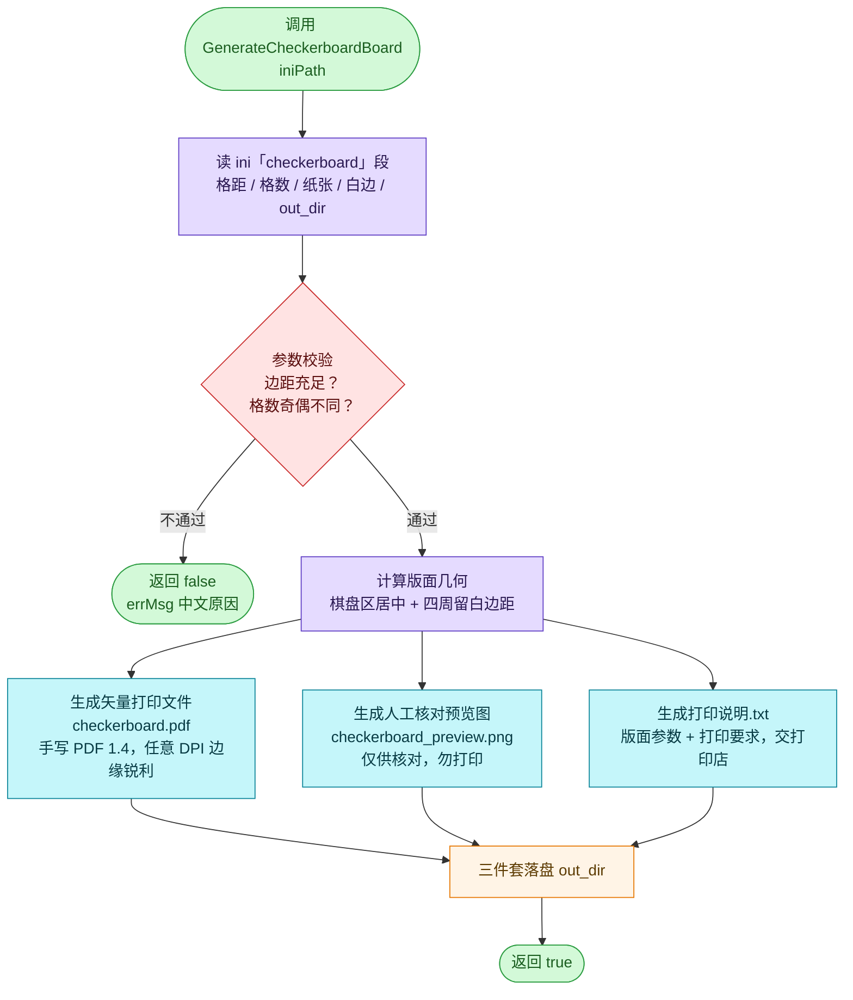
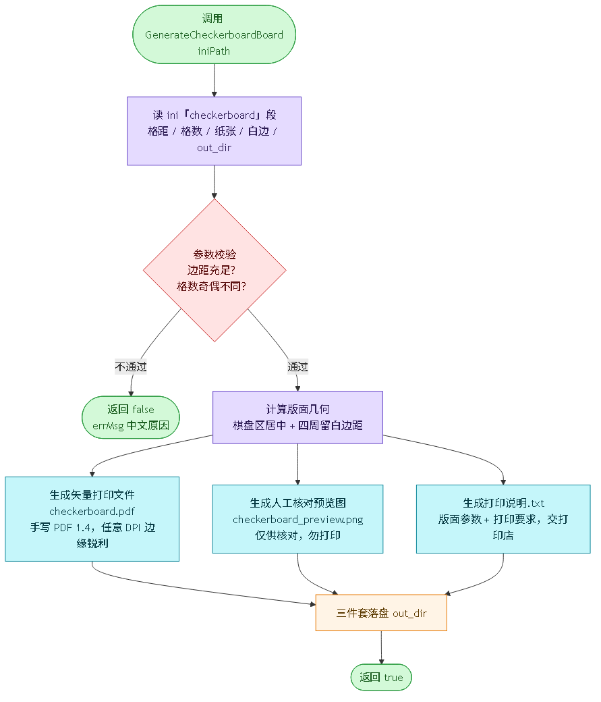
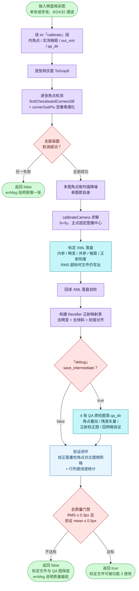
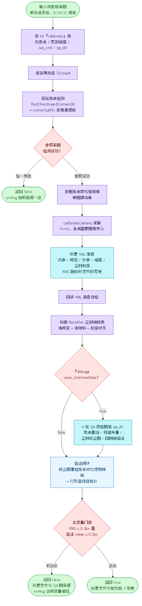
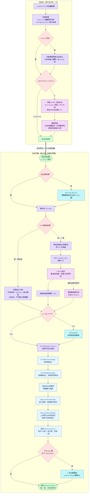

# Calibrate_and_Measure 三大功能流程图

> 创建时间：2026-09-09
> 与当日代码版本一致；接口签名详见工程根目录 `INTERFACE.md`
> 渲染方式：VS Code（Mermaid 插件）、GitHub、Typora、Obsidian 均可直接预览

---

## 图 1：功能 1 制板 —— 棋盘格标定板生成

对应入口 `cam::GenerateCheckerboardBoard(iniPath, errMsg)`（`src/checkerboard/board_generator.cpp`）。
特点：单入口、参数全在 ini 的 `[checkerboard]` 段，一次调用产出打印三件套。

无 Mermaid 渲染环境时可直接查看 PNG：

要点说明：

- 参数校验不过时不产生任何文件，errMsg 给出具体中文原因（如边距不足、格数奇偶相同）。
- PDF 为矢量格式，打印店按 100% 实际大小输出即可，不存在 DPI 模糊问题。

---

## 图 2：功能 2 标定 —— 棋盘格标定求解

对应入口 `cam::BuildCalibrationFile`（单图）/ `cam::BuildCalibrationFileFromImages`
（多图取均值降噪）（`src/calibration/calibrator.cpp`）。
特点：求解、落盘、质检、验证闭环一次完成，两级质量门禁兜底。

无 Mermaid 渲染环境时可直接查看 PNG：

要点说明：

- 实测格距 `square_x_mm` / `square_y_mm` 务必用卡尺量打印实物后回填 ini 再标定，
  否则打印缩放误差直接进入测量结果。
- 质量门禁不达标时产物不删除，便于对照 QA 图排查（印刷精度 / 采图条件）后重标。

---

## 图 3：功能 3 测量 —— 单帧测量主流程

对应 `cam::Rectifier` + `cam::MeasurePipeline`
（`src/calibration/rectifier.cpp`、`src/measure/` 下各模块）。
特点：初始化只做一次（重操作集中在此），逐帧调用为"先矫正、再纯测量"。

```mermaid
graph TB
    subgraph initLane["初始化（软件启动时一次）"]
        icfg[LoadFromIni 读全量配置] --> ibg[背景建模<br/>input_dir 全量图中位数<br/>+ background_file 缓存加速]
        ibg --> ibgr{rectify 开启？}
        ibgr -->|是| ibgc[背景模型同步正射校正<br/>与后续输入图同一张 remap 表]
        ibgr -->|否| iseg
        ibgc --> iseg{segmentation.method}
        iseg -->|traditional| iready[流水线就绪]
        iseg -->|ai| ionnx[创建 ONNX 分割会话<br/>device=auto 预检 CUDA 环境<br/>缺运行时自动走 CPU]
        ionnx --> iwarm[模型预热<br/>合成灰图跑通一次完整推理<br/>消除首帧秒级卡顿]
        iwarm --> iready
    end

    subgraph frameLane["逐帧测量（每收到一帧相机原图）"]
        fin([相机原始图<br/>8/24/32 通道]) --> frect{矫正器就绪？}
        frect -->|是| frect2[Rectifier.Rectify<br/>原图重映射为正射 metric 图]
        frect -->|否| fgray[转灰度 ToGray8]
        frect2 --> fgray
        fgray --> fseg{AI 分割器就绪？}
        fseg -->|否，传统链| ftrad[背景差分分割<br/>双边滤波 + gamma + 差分阈值<br/>+ 形态学，产掩膜与增强图]
        fseg -->|是，AI 链| fcoarse[传统背景差分粗定位<br/>得 ROI 包围盒]
        fcoarse --> fcrop[外扩 expand_ratio<br/>裁剪 ROI]
        fcrop --> fonnx[ONNX 推理<br/>置信度过阈，取最大面积实例]
        fonnx --> fmap[掩膜映射回原图 ∩ ROI]
        fonnx -.->|漏检或推理异常| ffb[退回粗掩膜兜底<br/>日志记 fallback]
        ftrad --> frefine{ai_seg.refine？}
        fmap --> frefine
        ffb --> frefine
        frefine -->|true| fref2[RefineMask<br/>亚像素边缘精修]
        frefine -->|false| fcontour[ExtractOuterContour<br/>提取产品外轮廓]
        fref2 --> fcontour
        fcontour --> fang1[FindReferenceAngle<br/>角度粗校正]
        fang1 --> fang2[RefineAngleByEdges<br/>边缘精校正，两级角度相加]
        fang2 --> frot[按总校正角旋转<br/>增强图与掩膜]
        frot --> fmeas[MeasureWidthHeight<br/>语义宽高，四线闭合矩形]
        fmeas --> fedge[MeasureRankedEdges<br/>上半部分水平边排名<br/>缺失不视为错误]
        fedge --> fasm[组装 MeasureOutput<br/>坐标/长度 2 位小数，角度 3 位]
        fasm --> fdbg{「debug」且<br/>给了 debugTag？}
        fdbg -->|是| fimg[6 张过程图落<br/>output/debug/图像名/]
        fdbg -->|否| fout
        fimg --> fout([返回 MeasureOutput<br/>宽 / 高 / 水平边列表])
    end

    iready ==>|启动完成，进入逐帧测量| fin

    classDef startNode fill:#d3f9d8,stroke:#2f9e44,color:#1b5e20
    classDef decision  fill:#ffe3e3,stroke:#c92a2a,color:#5c1010
    classDef process   fill:#e5dbff,stroke:#5f3dc4,color:#2b1a52
    classDef ai        fill:#f3d9fa,stroke:#862e9c,color:#3d1348
    classDef meas      fill:#e7f5ff,stroke:#1971c2,color:#0b3d66
    classDef product   fill:#c5f6fa,stroke:#0c8599,color:#083b44
    class fin,fout,iready startNode
    class ibgr,iseg,frect,fseg,frefine,fdbg decision
    class icfg,ibg,ibgc,fgray,fcoarse,fcrop,fmap,ftrad,fcontour process
    class ionnx,iwarm,fonnx,ffb ai
    class fang1,fang2,frot,fmeas,fedge,fasm meas
    class frect2,fref2,fimg product
```

无 Mermaid 渲染环境时可直接查看 PNG：

要点说明：

- 测量函数本身不关心图像是否矫正过：矫正开启时调用方先 `Rectify` 再 `Measure`，
  关闭时原图直进 `Measure`，两种用法测量流程完全一致。
- AI 链中的传统粗定位是设计的一部分（ROI 级 100% 召回），不是回退；只有模型
  漏检或推理异常时该帧才退回粗掩膜，日志来源行显示 `fallback`。
- 水平边缺失只记 Warn 不影响宽高输出；`MeasureOutput.code` 语义见 INTERFACE.md 3.3。

---

## 变更记录

- 2026-09-09：初版，覆盖制板 / 标定 / 单帧测量三张流程图，与当日代码逐模块核对。
